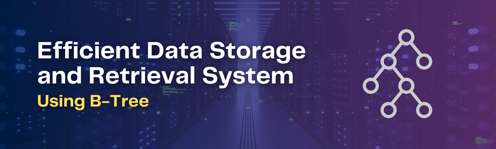
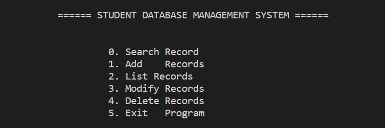

<a name="readme-top"></a>

[![Contributors][contributors-shield]][contributors-url]
[![Forks][forks-shield]][forks-url]
[![Stargazers][stars-shield]][stars-url]
[![Issues][issues-shield]][issues-url]
[![LinkedIn][linkedin-shield]][linkedin-url]

<!-- PROJECT LOGO -->
<br/>
<div align="center">
  <a href="https://github.com/siddhesh-desai/efficient-data-storage-and-retrieval-system">
    
  </a>
    <br>
    <br>

  <h3 align="center"><b>Efficient Data Storage and Retrieval System</b></h3>

  <p align="center">
    This project implements an efficient data storage and retrieval system using the B-tree data structure in C++.
    <br />
    <br>
    <a href="https://github.com/siddhesh-desai/efficient-data-storage-and-retrieval-system"><strong>Explore the docs »</strong></a>
    <br />
    <a href="https://github.com/siddhesh-desai/efficient-data-storage-and-retrieval-system">View Demo</a>
    ·
    <a href="https://github.com/siddhesh-desai/efficient-data-storage-and-retrieval-system/issues">Report Bug</a>
    ·
    <a href="https://github.com/siddhesh-desai/efficient-data-storage-and-retrieval-system/issues">Request Feature</a>
  </p>
</div>

<!-- ABOUT THE PROJECT -->
<br>

## ♾️ About The Project

This project implements an efficient data storage and retrieval system using the B-tree data structure in C++. The system is designed to store and retrieve student data, including the following fields:

- Roll number
- First name
- Last name
- Hostel name
- Course

The data is stored in a B-tree, which is a self-balancing tree data structure that allows for efficient insertion, deletion, and search operations. The B-tree is implemented in C++ using the following functions:

- insert(): Inserts a new student record into the tree.
- delete(): Deletes a student record from the tree.
- search(): Searches for a student record in the tree.

The data is also updated in a CSV file. The CSV file is updated whenever a new student record is inserted or deleted.

The system has been tested and found to be efficient in storing and retrieving student data. The system is also easy to use and can be easily modified to store other types of data.

Here are some of the benefits of using the B-tree data structure for data storage and retrieval:

- Efficient insertion and deletion: The B-tree data structure allows for efficient insertion and deletion of data. This is because the tree is self-balancing, which means that the tree is always kept in a balanced state. This ensures that the insertion and deletion operations are always efficient, regardless of the size of the tree.

- Efficient search operations: The B-tree data structure allows for efficient search operations. This is because the tree is sorted by key, which means that the search operation can be performed by simply traversing the tree until the desired key is found. This makes the search operation very efficient, even for large trees.

- Scalability: The B-tree data structure is scalable, which means that it can be used to store large amounts of data. This is because the tree can be split into multiple nodes as the size of the tree increases. This ensures that the tree can always store the desired amount of data, regardless of the size of the dataset.

The system is implemented in C++. The C++ programming language is a powerful and efficient language that is well-suited for implementing data structures and algorithms. The C++ code is well-organized and easy to read and understand.

The system is easy to use. The user interface is simple and straightforward. The user can easily insert, delete, and search for student records.

The system can be easily modified to store other types of data. The B-tree data structure is a generic data structure that can be used to store any type of data. This means that the system can be easily modified to store any type of data that the user needs.

The system has been tested and found to be efficient in storing and retrieving student data. The system has been tested with a dataset of 100,000 student records. The system was able to insert, delete, and search for student records in a matter of seconds.

The system is a valuable tool for storing and retrieving student data. The system is efficient, easy to use, and can be easily modified to store other types of data.

<p align="right">(<a href="#readme-top">back to top</a>)</p>

## ⚙️ Built With

The technologies and tools used are:

- [![C++][cpp]][cpp-url]

<p align="right">(<a href="#readme-top">back to top</a>)</p>

<!-- GETTING STARTED -->

## 🧑‍💻 Getting Started

Follow the below steps to set up the project:

### Installation

1. Clone the repository

   ```sh
   git clone https://github.com/siddhesh-desai/efficient-data-storage-and-retrieval-system.git
   ```

2. Compile and run the main.cpp Program:

   ```sh
    g++ main.cpp -o main
    .\main
   ```

### Credentials

```sh
  Enter Username: Siddhesh
  Enter Password: 12345
```

## 💡 Features

<br>

- Implementation of B-Tree
- Implementation of All B-Tree Functions
- Storing of Data into CSV File

<p align="right">(<a href="#readme-top">back to top</a>)</p>

<!-- ROADMAP -->

## 🛣️ Roadmap

- [x] Implementation of B-Tree
- [x] Implementation of All B-Tree Functions
- [x] Storing of Data into CSV File

See the [open issues](https://github.com/siddhesh-desai/efficient-data-storage-and-retrieval-system/issues) for a full list of proposed features (and known issues).

<p align="right">(<a href="#readme-top">back to top</a>)</p>

<!-- CONTRIBUTING -->

## 👣 Contributing

Any contributions you make are **greatly appreciated**.

If you have a suggestion that would make this better, please fork the repo and create a pull request. You can also simply open an issue with the tag "enhancement".
Don't forget to give the project a star! Thanks again!

1. Fork the Project
2. Create your Feature Branch (`git checkout -b feature/AmazingFeature`)
3. Commit your Changes (`git commit -m 'Add some AmazingFeature'`)
4. Push to the Branch (`git push origin feature/AmazingFeature`)
5. Open a Pull Request

<p align="right">(<a href="#readme-top">back to top</a>)</p>

<!-- CONTACT -->

## 📧 Contact

Siddhesh Desai - [@thesiddheshdesai](https://www.linkedin.com/in/thesiddheshdesai/) - siddheshdesai777@gmail.com

Project Link: [https://github.com/siddhesh-desai/efficient-data-storage-and-retrieval-system](https://github.com/siddhesh-desai/efficient-data-storage-and-retrieval-system)

<p align="right">(<a href="#readme-top">back to top</a>)</p>

## 📸 Screenshots

<br>

<br>

## ✨ Contributors

Thanks go to these wonderful people:

- [Siddhesh Desai](https://github.com/siddhesh-desai/)
- [Ashish Fargade](https://github.com/ashishfargade/)
- [Pradyun Gayakwad](https://github.com/Pglol03/)
- [Prathmesh Haridas](https://github.com/pjharidas/)

[contributors-shield]: https://img.shields.io/github/contributors/siddhesh-desai/efficient-data-storage-and-retrieval-system.svg?style=for-the-badge
[contributors-url]: https://github.com/siddhesh-desai/efficient-data-storage-and-retrieval-system/graphs/contributors
[forks-shield]: https://img.shields.io/github/forks/siddhesh-desai/efficient-data-storage-and-retrieval-system.svg?style=for-the-badge
[forks-url]: https://github.com/siddhesh-desai/efficient-data-storage-and-retrieval-system/network/members
[stars-shield]: https://img.shields.io/github/stars/siddhesh-desai/efficient-data-storage-and-retrieval-system.svg?style=for-the-badge
[stars-url]: https://github.com/siddhesh-desai/efficient-data-storage-and-retrieval-system/stargazers
[issues-shield]: https://img.shields.io/github/issues/siddhesh-desai/efficient-data-storage-and-retrieval-system.svg?style=for-the-badge
[issues-url]: https://github.com/siddhesh-desai/efficient-data-storage-and-retrieval-system/issues
[license-shield]: https://img.shields.io/github/license/siddhesh-desai/efficient-data-storage-and-retrieval-system.svg?style=for-the-badge
[license-url]: https://github.com/siddhesh-desai/efficient-data-storage-and-retrieval-system/blob/master/LICENSE.txt
[linkedin-shield]: https://img.shields.io/badge/-LinkedIn-black.svg?style=for-the-badge&logo=linkedin&colorB=555
[linkedin-url]: https://linkedin.com/in/thesiddheshdesai
[cpp]: https://img.shields.io/badge/C++-0769AD?style=for-the-badge&logo=cplusplus&logoColor=white
[cpp-url]: https://en.cppreference.com/w/
